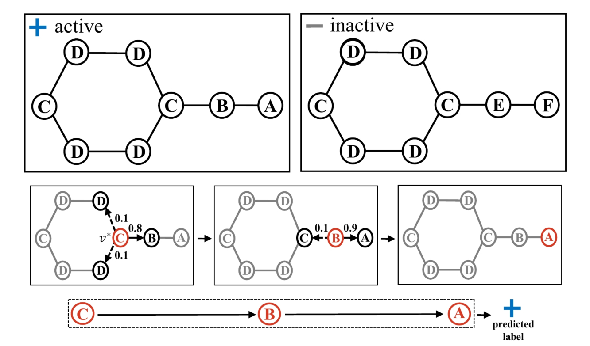
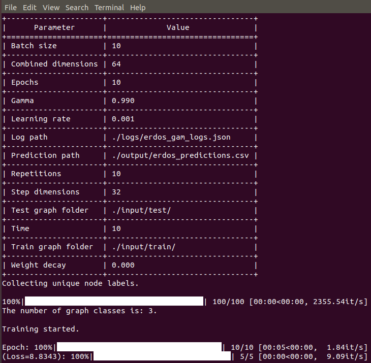

GAM
=========
[](https://paperswithcode.com/sota/graph-classification-on-hiv-dataset?p=graph-classification-using-structural) [](https://codebeat.co/projects/github-com-benedekrozemberczki-gam-master) [](https://github.com/benedekrozemberczki/GAM/archive/master.zip) [](https://twitter.com/intent/follow?screen_name=benrozemberczki)

A **PyTorch** implementation of **Graph Classification Using Structural Attention (KDD 2018).**

<div style="text-align:center"></div>

### Abstract
<p align="justify">
Graph classification is a problem with practical applications in many different domains. To solve this problem, one usually calculates certain graph statistics (i.e., graph features) that help discriminate between graphs of different classes. When calculating such features, most existing approaches process the entire graph. In a graphlet-based approach, for instance, the entire graph is processed to get the total count of different graphlets or subgraphs. In many real-world applications, however, graphs can be noisy with discriminative patterns confined to certain regions in the graph only. In this work, we study the problem of attention-based graph classification . The use of attention allows us to focus on small but informative parts of the graph, avoiding noise in the rest of the graph. We present a novel RNN model, called the Graph Attention Model (GAM), that processes only a portion of the graph by adaptively selecting a sequence of “informative” nodes. Experimental results on multiple real-world datasets show that the proposed method is competitive against various well-known methods in graph classification even though our method is limited to only a portion of the graph.</p>

This repository provides an implementation for GAM as described in the paper:

> Graph Classification using Structural Attention.
> John Boaz Lee, Ryan Rossi, and Xiangnan Kong
> KDD, 2018.
> [[Paper]](http://ryanrossi.com/pubs/KDD18-graph-attention-model.pdf)


### Requirements

The codebase is implemented in Python 3.5.2. package versions used for development are just below.
```
networkx           2.4
tqdm               4.28.1
numpy              1.15.4
pandas             0.23.4
texttable          1.5.0
argparse           1.1.0
sklearn            0.20.0
torch              1.2.0.
torchvision        0.3.0
```
### Datasets
<p align="justify">
The code takes graphs for training from an input folder where each graph is stored as a JSON. Graphs used for testing are also stored as JSON files. Every node id, node label and class has to be indexed from 0. Keys of dictionaries and nested dictionaries are stored strings in order to make JSON serialization possible.</p>

For example these JSON files have the following key-value structure:

```javascript
{"target": 1,
 "edges": [[0, 1], [0, 4], [1, 3], [1, 4], [2, 3], [2, 4], [3, 4]],
 "labels": {"0": 2, "1": 3, "2": 2, "3": 3, "4": 4},
 "inverse_labels": {"2": [0, 2], "3": [1, 3], "4": [4]}}
```
<p align="justify">
The **target key** has an integer value, which is the ID of the target class (e.g. Carcinogenicity). The **edges key** has an edge list value for the graph of interest. The **labels key** has a dictonary value for each node, these labels are stored as key-value pairs (e.g. node - atom pair). The **inverse_labels key** has a key for each node label and the values are lists containing the nodes that have a specific node label.</p>

### Options

Training a GAM model is handled by the `src/main.py` script which provides the following command line arguments.

#### Input and output options

```
  --train-graph-folder   STR    Training graphs folder.      Default is `input/train/`.
  --test-graph-folder    STR    Testing graphs folder.       Default is `input/test/`.
  --prediction-path      STR    Path to store labels.        Default is `output/erdos_predictions.csv`.
  --log-path             STR    Log json path.               Default is `logs/erdos_gam_logs.json`. 
```

#### Model options

```
  --repetitions          INT         Number of scoring runs.                  Default is 10. 
  --batch-size           INT         Number of graphs processed per batch.    Default is 32. 
  --time                 INT         Time budget.                             Default is 20. 
  --step-dimensions      INT         Neurons in step layer.                   Default is 32. 
  --combined-dimensions  INT         Neurons in shared layer.                 Default is 64. 
  --epochs               INT         Number of GAM training epochs.           Default is 10. 
  --learning-rate        FLOAT       Learning rate.                           Default is 0.001.
  --gamma                FLOAT       Discount rate.                           Default is 0.99. 
  --weight-decay         FLOAT       Weight decay.                            Default is 10^-5. 
```

### Examples
<p align="justify">
The following commands learn a neural network, make predictions, create logs, and write the latter ones to disk.

Training a GAM model on the default dataset. Saving predictions and logs at default paths.</p>
```
python src/main.py
```
<p align="center">

</p>

Training a GAM model for a 100 epochs with a batch size of 512.
```
python src/main.py --epochs 100 --batch-size 512
```
Setting a high time budget for the agent.
```
python src/main.py --time 128
```
Training a model with some custom learning rate and epoch number.
```
python src/main.py --learning-rate 0.001 --epochs 200
```
--------------------------------------------------------------------

**License**

- [GNU License](https://github.com/benedekrozemberczki/GAM/blob/master/LICENSE)

-----------------------------------------------------------------
